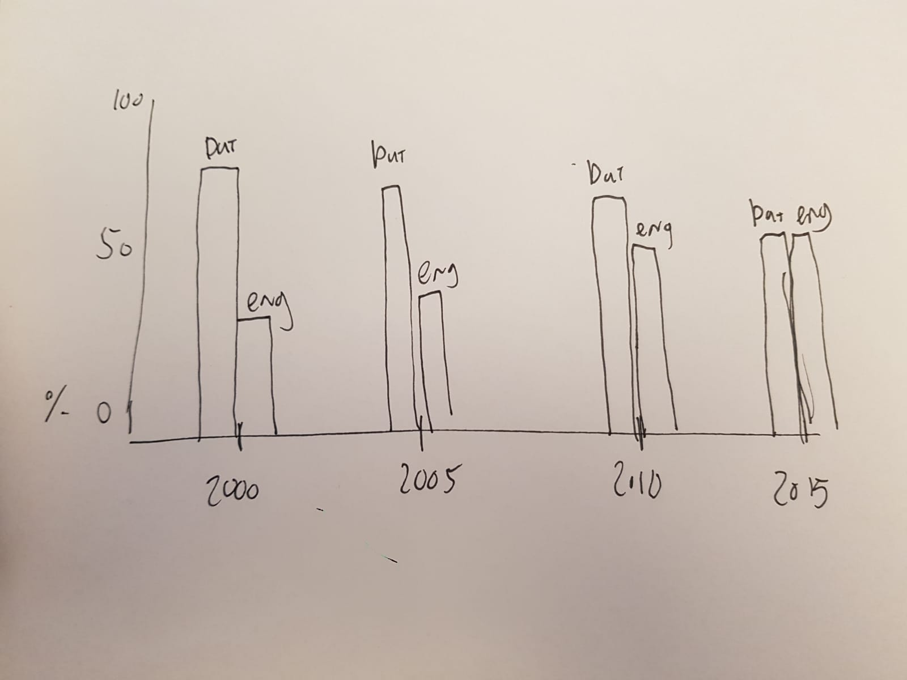

# OBA API USER

## Week 2

### Day 1
Installed Rijks module to make node.js calls to the oba API. 
```node
$ npm install rijkvanzanten/node-oba-api
```
This also turns the xml into a json object.

Modified the code with 
```js
fs.writeFile('myjsonfile.json', res, 'utf8')
```
to be able to take a better look at the results of my search queries.

with ```http://jsonviewer.stack.hu/``` I was able to see the structure of the datamodel way better. This also helped me defining my possible research subjects

### Day 2

#### 5 possible research cases (in Dutch):

* Meer engelstalige boeken sinds Nederland steeds internationaler is?
* Bepaalde onderwerpen die vaker voorkomen, bijv: Meer boeken over programmeren?
* Komen er steeds minder boeken bij in het assortiment?
* Correlatie dikte van boeken en het onderwerp (worden woordenboeken dikker of dunner over tijd?)
* In welke taal zijn boeken het dikst

### Day 3

Pushing the results to a javascript object using JSON.parse. The json I receive when doing a request is now a javascript array which is easier to manipulate.

Once all results are in an array I can modify the results and choose to only display parts of it.

Example:

```js
boeken.push(["id: " + id, "titel: " + boek.titles.title.$t, "taal: " + boek.languages.language.$t]);
```

Here I can access different fields of the books that my search query returns. A few fields I'm able to access now:

```js
    boek.titles.title.$t// titel
    boek.authors['main-author'].$t // hoofdauteur
    boek.authors.author.$t // auteur
    boek.languages.language.$t // taal
    boek.publication.year.$t // jaartal
    boek.summaries.summary.$t // samenvatting
```

Next step for me was making a book instance. Instead of putting all the fields in the boeken.push, I'm now creating an object with certain parameters. This also allowed me to easier check whether a field is undefined.

```js
    var boekInstantie = {
      id : id,
      titel : boek.titles.title.$t,
      taal : (typeof boek.languages === "undefined") ? 'Taal onbekend' : boek.languages.language.$t,
      jaartal : (typeof boek.publication === "undefined" || typeof boek.publication.year === "undefined") ? 'Jaar onbekend' : boek.publication.year.$t,
      author : (typeof boek.authors === "undefined" || typeof boek.authors['main-author'] === "undefined")  ? "Auteur onbekend" : boek.authors['main-author'].$t
    }
```

This code snippet adds id, title, language, year and author to the boek instance var. Code is added to check whether certain objects exist in the database. If they don't it displays a static message saying the info is missing.

#### More experimentation with the search query.

Experimenting with the different parameters. 

```js
facet: 'type(book)' 
```

Only when using:

```js
refine: true
```

It's possible to filter on the different facets.

Different types of facets (from the documentation):

```html
    <value count="422426" id="book" />
    <value count="2059" id="dvdvideo" />
    <value count="2186" id="movie" />
    <value count="3678" id="largetype" />
```

Should return only the results of the book type.

*Pagesize doesn't seem to work which for now prevents me from retrieving more than 20 results.*

After contacting Mark I found out the pagesize command was disabled due to performance issues. He asked a developer whose advice was just doing several request to retrieve the different pieces.

### Day 4

I decided to start using my application to find some more info about my research case. The first research question I will be actively searching data for is: "Over time, has the percentage of English books grown because the people of the Netherlands became more internationally oriented?"

The only data I need for this is the publication date of a book and the language it is in, so those are the fields I requested. (plus id to have a unique identifier)

```js
[boekInstantie.id, boekInstantie.jaartal, boekInstantie.taal]
```

To tackle the 20 results max problem for now I made a temporary solution that uses a for loop to send out more get requests. The for loop iterates as many times as specified by amountPages, and each loop it requests the next page. All pages will be pushed to the boeken[] array when these requests are done. Although I should definitely use a promise or something else here, for now it just has a set timeout of 4 seconds (I know, I know).

```js
setTimeout(function(){ 
  console.log(boeken)
  fs.writeFile('dataset.js', boeken, 'utf8', function(){})
}, 4000);
```

This gives me the following structure:

```js
[['632528', '2006', 'dut'],
['13276', '2000', 'eng'],
['809186', '2008', 'dut'],
['1127074', '2014', 'eng'],
['340774', '1991', 'dut'],
['633849', '2006', 'eng'],
['356182', '1988', 'dut'],
['1120718', '2015', 'dut'],
['751340', '2007', 'dut'],
['935383', '2009', 'eng'],
['1197765', '2018', 'eng'],
['793611', '2006', 'eng'],
['206687', '1989', 'Taal onbekend'],
['550597', '2004', 'eng'],
['725551', '1998', 'eng'],
['878360', '2008', 'eng'],
['960622', '1988', 'ger']]
```

To create a small but sufficient for now dataset I set amountPages to 5. That way I'll get 100 results to work with.

For this research case I will only be using the results that have either 'dut' or 'eng' as their main language because that is the relationship I'm interested in (percentage Dutch v English books.)

https://rawgraphs.io/
https://codeshack.io/json-sorter/

### Day 5
First review of readme, reading general tips on improving read me. Less code, more process.

First info on d3.js and some expirimentation with d3.

Looking into different types of charts and data visualisation to use.

## Week 2

### Day 6

#### Possible ways to visualize the difference in Dutch/English books over the years.

##### Proportional area chart

A proportional area chart to showcase the difference in english / dutch books over the years.

https://datavizcatalogue.com/methods/area_chart.html

This type of visualisation shows the difference in amount of books both by size and by displaying the value.


##### Grouped bar chart



Shows a percentual value per language for each year.


