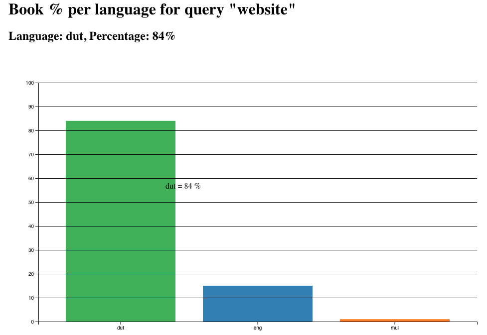
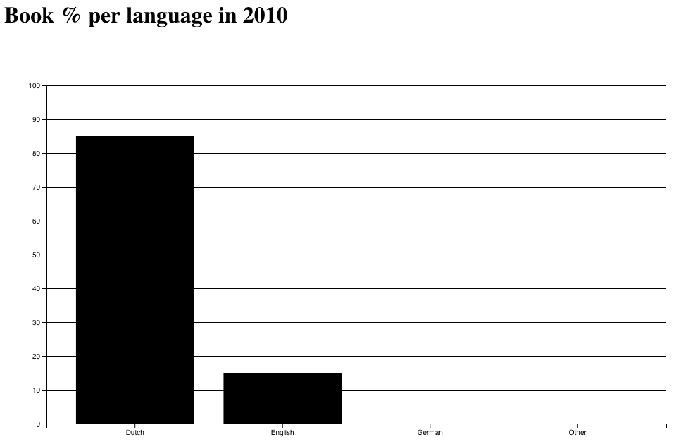
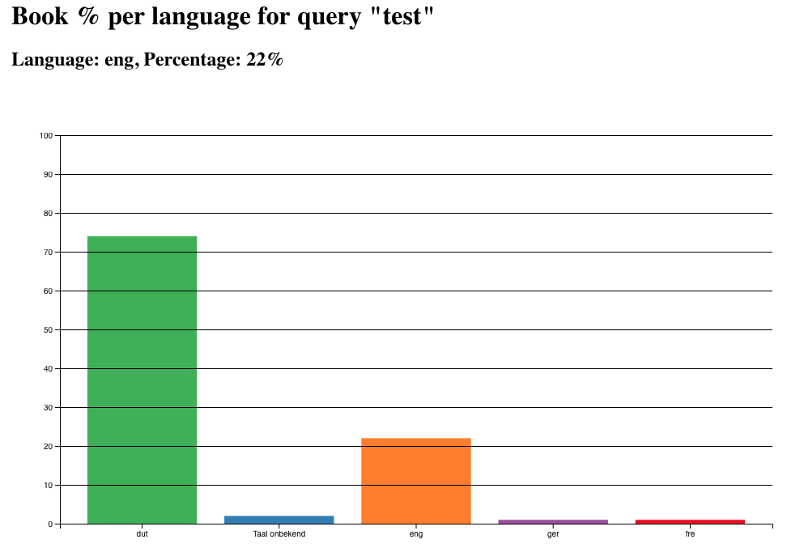

# Functional programming

[Try out my application here!](https://joostflick.github.io/frontend-data/)

_links to old READMEs_

[Old README about code](README-code.md)

[Old README](README-old.md)

## Installation & usage

1. Download the project
2. Run `npm install`
3. To change the query edit the query var in index.js
4. Run `npm start`
5. Open docs/index.html in your browser

I implemented the following commands:

`npm run build` runs browserify to make my application usable in a browser environment

`npm run data` makes a get request to retrieve new data and add it to the d3 environment

`npm start` runs both of the above commands, first retrieving data then building the app so it can be displayed in the browser

## What did I change for the redo?

#### Before:

#### After:

### Browserify

I added browserify to be able to display external data in my d3 graph. This way it's possible to just use one script to retrieve data and display it.

### Code quality

I removed the long pieces of code to calculate percentages using a lot of magic numbers from my API logic, and moved it to my d3 file. This made it possible to use d3 functionality like nest() to clean my data more easily.

### % per query

I changed the functionality of the application to display the percentage difference between the languages per query, instead of per year. The title automatically changes based on the query that is used.

This gives valuable insights I could have used during front-end data.

### Mouse events & colors

I added a tooltip when hovering a bar, showing the percentage and language. This data will also be displayed on top of the graph when clicking one of the bars. Also each language is now assigned a color.

### Animations

I added a simple entrance animation for the bar chart.

## Functionality of the application

Display the distribution of all languages for a certain query. The user can interact with the bars to see the exact percentages.

When adding the year: query this could form a base for my research case in which I try to find correlations between certain queries and how their language distribution has changed over the years.

## Data usage

My get request fills an Array with book instances which have the following properties:

- ID
- query
- title
- language
- year
- author

At the moment my application only uses the language field in combination with the amount of times that language exists in the dataset. This way I can calculate the percentages to display in the bar chart.

Although the rest of the fields of the book objects aren't used at the moment, they could be used to give the user more details about certain books in further iterations in the future.
