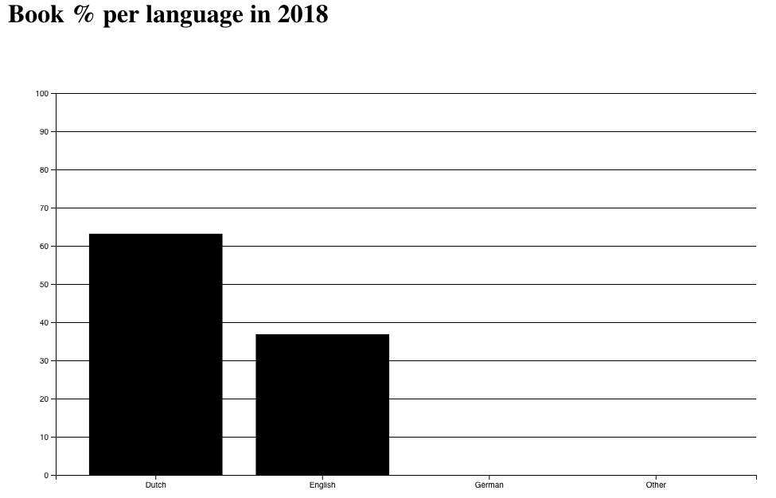

# Research case OBA using the OBA API

For a more code-based approach, and a day by day report, [click here](README-old.md)

## Table of contents

* OBA API
* My research
* Results
* Problems
* Some highlights

## OBA API

Before formulating any of my main research points, I first had to explore the possibilities of the API provided by the OBA.

I read (most of) the documentation and experimented with different search queries using the [node-oba-api](https://github.com/rijkvanzanten/node-oba-api) by Rijk van Zanten.

This made it possible to do a request and receive the results as json. These results were then written to a file by me.

I added the contents of this file to a [webbased json viewer](http://jsonviewer.stack.hu) and being able to view the data in a treelike structure greatly improved my understanding of the OBA API.

After experimenting with different ways to compose a search query I had enough information to start working on my research case.

## My research

At this point I knew roughly what type of data I could retrieve from the OBA API. Some of those gave me inspiration for my research questions;

* Publishing year
* Language of the book
* Title of the book
* Amount of pages
* Book themes

With this information I formulated the following research questions:

1. Are there more English books as opposed to Dutch books since the Netherlands are becoming more internationally focussed?
2. Are there certain subjects that have become more apparent over time (for example books about programming)?
3. Over time, are there less books being added to the library because books as a medium are losing interest?
4. Is there a correlation between the subject of a book and the thickness (or amount of pages) of that book?
5. Which languages have the thickest books (amount of pages)?

After researching the different datasets I could obtain using the API I decided to go with my first question; 

"Over time, are there more English books in comparison to Dutch books in the OBA collection since the Netherlands are more and more internationally focussed?"

Sub-questions related to this question:

1. For each year, what is the proportion of the English books as opposed to the Dutch books?
2. Which queries give an honest Dutch/English representation?
3. Which values are needed to be able to see a change over the years?

I decided to use the following datavalues per book:

* ID
* Publishing year
* Language

With these I filled a dataset with books from a certain year. This way I was able to see the distribution of Dutch/English books per year.

I wrote a function to determine the percentage of books in each language so I could make a graph. This means that whenever I run it I receive the following data:

```json
[ { year: 2015, lang: 'Dutch', value: 63.333333333333336 },
  { year: 2015 lang: 'English', value: 33.333333333333336 },
  { year: 2015 lang: 'German', value: 3.333333333333335 },
  { year: 2015lang: 'Other', value: 0 } ]
```
For now I use multiple queries to request multiple years. 

Per year I receive 5 pages of data, so 100 books. 

When (for now manually) inserting those in my d3 visualisation I should already be able to see some sort of change in the amount of English books.

For my first visualization of this data I decided go with a bar chart per year. Later I want this to be a grouped bar chart so you have a clear overview of multiple years like this:


For now I made a bar chart in d3 that works per year. By making a query to look up 100 books in 2010 and another one to look up 100 books in 2018 I can already make some comparisons.

Example: 



This very primitive comparison is an example of a way to prove my hypothesis. As you can see there are relatively more English books in the 2018 chart.

As of now though, my sample size is way too small and the results are too inconsistent to draw any legitimate conclusions from these charts.


### Hypothesis
*Each year the amount of English books as opposed to the amount of Dutch books grows*

## Results

WIP

## Problems

Here are some of the things that made it harder for me to answer my research question:

* Uncertainty about the amount of books needed to get significant results
* What query to use to have a representative distribution of English and Dutch books
* The best way to display my results

## Some highlights

WIP